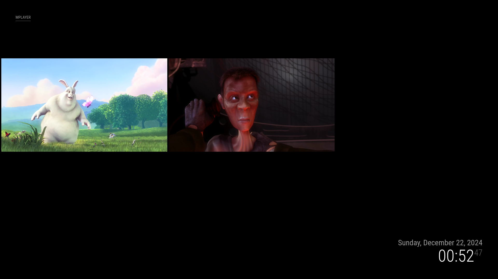

# MMM-MPlayer
This is a module for [MagicMirror²](https://github.com/MagicMirrorOrg/MagicMirror) that uses MPlayer to display various video files and RTSP streams.

## Screenshot


## Project Status
The main branch contains the new code (version 2).<br>
Testing on my test environment was successful, but I did not test all option variations / combinations (yet).<br>
See the [known bugs](#known-bugs) section for reported bugs.<br>
See the [opening issues](#opening-issues) section for some more information when reporting an issue.

If you are a user of version 1 of this module, please be aware that the configuration is slightly different and that more options are available. It is advisable to move a working version of this module before installing the new version.

PIR functions have not been tested by me, as I do not use it.

## Installation of mplayer
### Verify if mplayer is already installed
```shell
$ which mplayer
/usr/bin/mplayer
```
### Install mplayer (when not installed yet)
```shell
$ sudo apt install -y mplayer
```

## Installation of the MM module
1. In your terminal, change to your MagicMirror module directory `cd ~/MagicMirror/modules`

2. Clone this repository `git clone https://github.com/evroom/MMM-MPlayer`

3. Make changes to your `config.js` file.

### Config Example
Edit the file `~/MagicMirror/config/config.js` to add or modify the module.
```javascript
{
  module: 'MMM-MPlayer',
  disabled: false,
  position: "top_left",
  header: "MPlayer",
  config: {
    layout: 'row',
    streamInterval: 30000,
    monitorAspect: 0,
    noAspect: false,
    noBorder: true,
    rotate: -1,
    windowPosition: { x: 5, y: 225 },
    windowSize: { width: 640, height: 360 },
    windowWidth: 640,
    windowWidthNoNewAspect: 640,
    windowHeightNoNewAspect: 360,
    rtspStreamOverTcp: false,
    rtspStreamOverHttp: false,
    preferIpv4: false,
    ipv4onlyProxy: false,
    videoOutputDriver: 'xv,gl,gl_nosw,vdpau,',
    noSound: false,
    mplayerOptions: '',  
    windows: [
      {
        windowSize: { width: 640, height: 360 },
        windowPosition: { x: 5, y: 225 },
        streams: [
          'rtsp://foo',
          'rtsp://bar'
        ]
      },
      {
        windowSize: { width: 640, height: 360 },
        windowPosition: { x: 5, y: 590 },
        streams: [
          'something_one.mp4',
          'something_two.mp4'
        ]
      }
    ]
  }
},
```
## Configuration Options 
###
| Option | Description |
| ------------- | ------------- |
| `streamInterval`  | Cycles the streams defined in `windows` after the provided interval (in milliseconds).<br>Where applicable, the streams will start from the beginning again (for example for mp4 videos).<br>**Default value:** `30000` |
| `layout`  | Places windows in a row or a column.<br>If not set to row or column, an explicit `windowPosition` entry is expected in the `windows` object.<br>**Possible values:** `''` \| `'row'` \| `'column'`<br>**Default value:** `''` |
| `monitorAspect`  | Set the aspect ratio of your monitor or TV screen.<br>**Remark:** `monitorAspect` takes precedence over `noAspect`<br>**Example values:** `16:9` \| `'1.7777'` \| `4:3` \| `'1.3333'`<br>**Default value:** `0` |
| `noAspect`  | Disable automatic movie aspect ratio compensation.<br>**Possible values:** `true` \| `false`<br>**Default value:** `false` |
| `noBorder`  | Disable playing movie with window border and decorations.<br>**Possible values:** `true` \| `false`<br>**Default value:** `false` |
| `rotate`  | Rotate window.<br>-1: Do not rotate (default).<br>0: Rotate by 90 degrees clockwise and flip.<br>1: Rotate by 90 degrees clockwise.<br>2: Rotate by 90 degrees counterclockwise.<br>3: Rotate by 90 degrees counterclockwise and flip.<br>**Possible values:** `-1` \| `0` \| `1` \| `2`<br>**Default value:** `-1` |
| `windowPosition`  | Position of the first window (window-0).<br>The other windows will be either 5px below or to the right of this window, depending on `layout`value.<br>Can be left empty as it can be set in the `windows` object.<br>**Default value:** `{ x: 5, y: 225 }` |
| `windowSize`  | Window size for the windows.<br>Can be left empty as it can be set in the `windows` object.<br>**Remark:** `windowSize` takes precedence over `windowWidthNoNewAspect`, `windowHeightNoNewAspect` and `windowWidth`<br>**Default value:** `{ width: 640, height: 360 }` |
| `windowWidthNoNewAspect`  | Scale image to width <x> - disables aspect calculations.<br>**Remark:** `windowWidthNoNewAspect` takes precedence over `windowHeightNoNewAspect`<br>**Example value:** `640`<br>**Default value:** `''` |
| `windowHeightNoNewAspect`  | Scale image to height <y> - disables aspect calculations.<br>**Example value:** `360`<br>**Default value:** `''` |
| `windowWidth`  | Set width to value and calculate height to keep correct aspect ratio.<br>**Remark:** `windowWidth` takes precedence over `windowWidthNoNewAspect` and `windowHeightNoNewAspect`<br>**Example value:** `640`<br>**Default value:** `''` |
| `rtspStreamOverTcp`  | Used with 'rtsp://' URLs to specify that the resulting incoming RTP and RTCP packets be streamed over TCP.<br>**Remark:** `rtspStreamOverTcp` takes precedence over `rtspStreamOverHttp`<br>**Possible values:** `true` \| `false`<br>**Default value:** `false` |
| `rtspStreamOverHttp`  | Used with 'http://' URLs to specify that the resulting incoming RTP and RTCP packets be streamed over HTTP.<br>**Possible values:** `true` \| `false`<br>**Default value:** `false` |
| `preferIpv4`  | Use IPv4 on network connections. Falls back on IPv6 automatically.<br>**Possible values:** `true` \| `false`<br>**Default value:** `false` |
| `ipv4onlyProxy`  | Skip the proxy for IPv6 addresses. It will still be used for IPv4 connections.<br>**Possible values:** `true` \| `false`<br>**Default value:** `false` |
| `videoOutputDriver`  | Specify a priority list of video output drivers to be used.<br>Use 'mplayer -vo help' for more info.<br>**Possible values:** `true` \| `'false'`<br>**Default value:** `false` |
| `noSound`  | Do not play/encode sound.<br>**Possible values:** `true` \| `false`<br>**Default value:** `false` |
| `mplayerOption`  | Use additional mplayer option.<br>This option is to experiment with the mplayer options.<br>**Possible values:** see 'man mplayer' for the possible options.<br>**Example value:** `'-flip'`<br>**Default value:** `''` |
| `windows`  | Array of window objects with individual configuration |
| &emsp; `windowSize`  | Window size.<br>Can be left empty but is required when `layout` is not 'row' or 'column'.<br>**Default value:** `{ width: 640, height: 360 }` |
| &emsp; `windowPosition`  | Position of the window.<br>Can be left empty but is required when `layout` is not 'row' or 'column'.<br>**Default value:** `{ x: 5, y: 225 }` |
| &emsp; other options  | All options, except for `streamInterval`, `layout` and `monitorAspect` can be used on the `windows` window objects. |
| &emsp; `streams`  | URL of the mp4 or rtsp stream(s).<br>**Default value:**'http://stream1.example.com/video1' |

### Streams for testing
These public streams can be used for testing:
- http://commondatastorage.googleapis.com/gtv-videos-bucket/sample/BigBuckBunny.mp4
- http://commondatastorage.googleapis.com/gtv-videos-bucket/sample/ElephantsDream.mp4
- http://commondatastorage.googleapis.com/gtv-videos-bucket/sample/VolkswagenGTIReview.mp4

## Test environment
This procedure has been tested on:

Test environment:
- MagicMirror version: v2.30.0
- Raspberry Pi 3 Model B Plus Rev 1.3 (1 GB RAM)
- Raspbian GNU/Linux 12 (bookworm)

Production environment:
- Raspberry Pi 4 Model B Rev 1.5 with 8 GB RAM
- Debian GNU/Linux 12 (bookworm)
- MagicMirror version: 2.30.0

## Support for MMM-pages
[Still under development]<br>
This module has support for the module MMM-pages:
https://github.com/sdetweil/MMM-pages

It will start and stop the video stream based on the notifications:
- NEW_PAGE
- PAGE_CHANGED
- SHOW_HIDDEN_PAGE
- LEAVE_HIDDEN_PAGE

If payload == 0 then START_STREAM_CYCLE else STOP_STREAM_CYCLE.<br>
Requirement for the moment, is that MMM-MPlayer needs to have page index 0, so it needs to be the first page in the config.

As it takes time before mplayer actually starts streaming, it can come to unwanted behaviour when the rotationTime is too short.

## Known issues
- When streaming a network camera using RTSP, it has been reported that the stream may lag or even freeze. It is not clear yet if this is a limitation of the Raspberry Pi or that the RTSP stream is causing this. One can try setting `rtspStreamOverTcp` or `rtspStreamOverHttp` to `true` to see if this improves streaming.

## Known bugs
- None

## Opening Issues
Opening an Issue is possible, but I cannot promise to be able to do something about it.<br>
The code for the module was inherited and many stuff heavily depends on the MPlayer code (the latest MPlayer release is 1.5, created on 2022-02-27).

When opening an issue, be sure to include you config, a good description of the issue and [MMM-MPlayer] entries you might find in the log(s). Activating the `logLevel` `DEBUG` will give extra information.

It is always recommended to first try if the stream will open in, for example, VLC Player and/or to use one of the public streams for testing, to see if streaming is possible at all.<br>
One can also copy / paste the `DISPLAY=:0 mplayer ...` string to the SSH terminal to see what happens and make adaptations to the mplayer command without the need of changing the MMM-MPlayer settings in the config.js file.

## Data gathering
Raspberry Pi (Debian) based, but might apply for other platforms as well.
```shell
$ grep version ~/MagicMirror/package.json
$ cat /proc/device-tree/model; echo
$ lsb_release -a
$ uname -a
$ free -h -t
```
```shell
$ ps -eaf | grep mplayer | grep -v grep
```
```shell
$ pm2 flush
$ pm2 restart MagicMirror
$ sleep 20
$ grep 'MMM-MPlayer' ~/.pm2/logs/MagicMirror-*.log
```
## Contributions
Code provided by user 'myfingersarecold'.<br>
https://forum.magicmirror.builders/user/myfingersarecold<br>
Code adapted by user 'evroom'.<br>
https://forum.magicmirror.builders/user/evroom<br>
Code adapted by user 'maxbethge'.<br>
https://github.com/maxbethge

## MPlayer Project
MPlayer Documentation:<br>
http://www.mplayerhq.hu/design7/documentation.html
<br>MPlayer man pages:<br>
$ man mplayer

## License
This project is licensed under the MIT License - see the [LICENSE](LICENSE) file for details.
